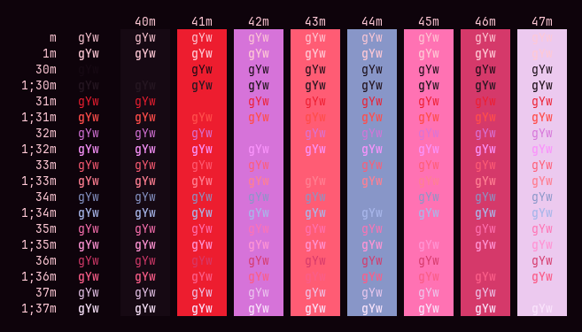
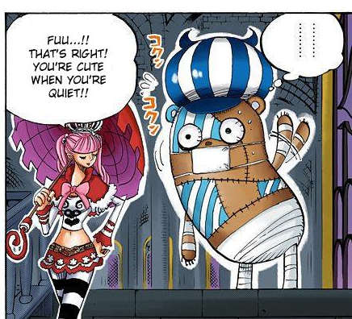

# Ghost Princess

a pink-tinged dark terminal theme inspired by ghost princess perona and her beloved kumashi

<div align="center">




</div>

## Installation

### WezTerm

```sh
git clone https://github.com/sailorfe/ghost-princess.git
cp ghost-princess/colors/ghost-princess.toml ~/.config/wezterm/themes
```

Then edit `wezterm.lua`:

```lua
config.local {
    color_scheme = "Ghost Princess"
}
```

### vim

```sh
git clone https://github.com/sailorfe/ghost-princess.git
cp ghost-princess/colors/ghost-princess.toml ~/.vim/colors
```
Open `.vim/colors/ghost-princess.vim` and `:source` it. Then in `.vim/vimrc`:

```vim
set background=dark
colorscheme ghost-princess
syntax on
```
