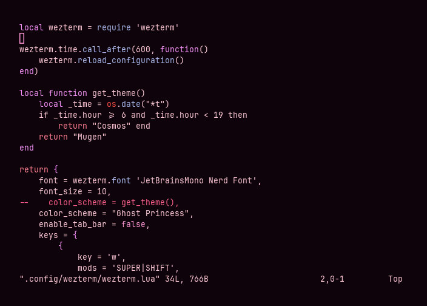
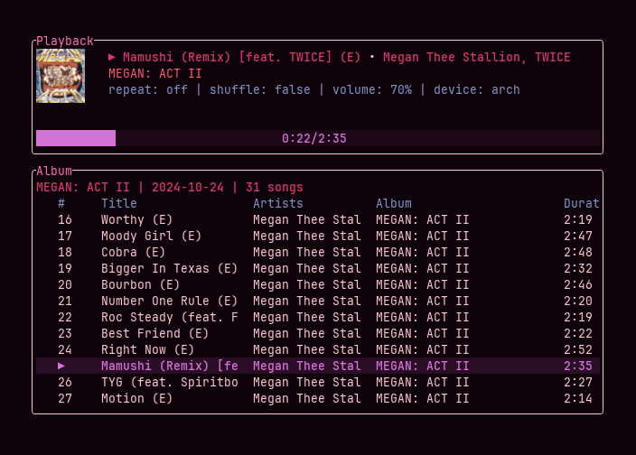

<div align="center">

# ghost princess

a pink-tinged dark theme inspired by ghost princess perona of thriller bark


</div>

## Palette

| name       | ansi                                                                | bright                                                                   |
| ---------- | ------------------------------------------------------------------ | ------------------------------------------------------------------ |
| background |  `#0e030b` |                                                                    |
| foreground |  `#fec8d5` |                                                                    |
| black      |  `#160813` |  `#271823` |
| red        |  `#ed1d2f` |  `#ff4d4a` |
| green      |  `#d673d9` |  `#f993fb` |
| yellow     |  `#ff5c74` |  `#ff7f92` |
| blue       |  `#8896c8` |  `#a8b6ea` |
| magenta    |  `#ff72b3` |  `#ff94d4` |
| cyan       |  `#d5396a` |  `#fa5d88` |
| white      |  `#ecc9ef` |  `#f9e3fb` |

## Installation

### WezTerm

```sh
git clone https://github.com/sailorfe/ghost-princess.git
cp ghost-princess/colors/ghost-princess.toml ~/.config/wezterm/themes
```

Then edit `wezterm.lua`:

```lua
config.local {
    color_scheme = "Ghost Princess"
}
```

### vim

```sh
git clone https://github.com/sailorfe/ghost-princess.git
cp ghost-princess/colors/ghost-princess.vim ~/.vim/colors
```
Open `.vim/colors/ghost-princess.vim` and `:source` it. Then in `.vim/vimrc`:

```vim
set background=dark
colorscheme ghost-princess
syntax on
```

## Screenshots

<div align="center">
    




</div>
